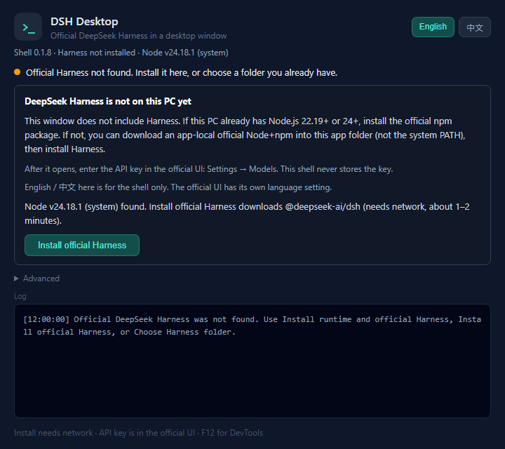

# DSH Desktop

English | [中文](README.zh.md)

[](https://github.com/shenzheyuan2020/dsh-desktop-shell/releases/latest)
[](https://github.com/shenzheyuan2020/dsh-desktop-shell/actions/workflows/ci.yml)
[](LICENSE)

A Windows desktop window around the official DeepSeek Harness `dsh web` UI: system tray, close-to-tray, crash restart, first-run install of the runtime and the official CLI, and separate updates for the shell and for official Harness.

**The shell is ours. The UI inside the window is the official product.** No fork, no vendoring, no injection into official source. When official Harness updates, the window shows that update.



## Table of contents

- [How it couples to official Harness](#how-it-couples-to-official-harness)
- [Install](#install)
- [First launch](#first-launch)
- [Daily use](#daily-use)
- [Updates: shell vs official Harness](#updates-shell-vs-official-harness)
- [Language](#language)
- [Configuration](#configuration)
- [Troubleshooting](#troubleshooting)
- [Development](#development)
- [Releasing (maintainers)](#releasing-maintainers)
- [Known limits](#known-limits)
- [Changelog](#changelog)
- [License](#license)

## How it couples to official Harness

Exactly three contracts, nothing else:

1. **Start** — spawn the configured `command` + `args` (append `--port 0` unless a port is set).
2. **Ready** — wait for the stdout line `dsh web: <URL>`, then load that URL with zero injection (no preload, sandboxed, loopback-only navigation; other links open in the system browser).
3. **Stop** — kill the whole backend process tree on quit or restart.

Custom tools or UI for the agent belong in official bundles / profiles / slots, not in this shell.

Official project: [deepseek-ai/deepseek-harness](https://github.com/deepseek-ai/deepseek-harness) · npm package: [`@deepseek-ai/dsh`](https://www.npmjs.com/package/@deepseek-ai/dsh)

## Install

1. Open the [latest Release](https://github.com/shenzheyuan2020/dsh-desktop-shell/releases/latest).
2. Download **`DSH-Desktop-Setup-<version>.exe`** (about 95 MB). Do not download the Source code zip — that is source, not the app.
3. The installer is unsigned. If Windows SmartScreen appears, choose **More info → Run anyway**. Each release's notes carry the installer's **SHA-256**; verify with `Get-FileHash` if you want.
4. Start **DSH Desktop** from the Start menu or the desktop shortcut.

Use the Setup installer. Shell auto-update only works for the installed app; `dist/win-unpacked` is a developer artifact and never updates.

## First launch

On every start the shell looks for official DeepSeek Harness, in this order:

1. The current `config.json` launch path (a source checkout in `cwd`, or a `dsh.cmd` you already chose)
2. The `DSH_CHECKOUT` environment variable, pointing at a clone that contains `apps/cli/src/bin.ts`
3. An official npm install this shell placed in `%APPDATA%\DSH Desktop\official-runtime`
4. A `dsh` command on PATH

If one is found, the official UI opens immediately. Otherwise the startup page acts as a short wizard — nothing installs until you confirm.

### Option A — install from the shell (no git clone)

Node is optional to install yourself. The shell prefers, in order: a **system** Node.js 22.19+/24+ with npm; an **app-local** official Node already in `%APPDATA%\DSH Desktop\bundled-node` (never on the system PATH); or nothing — then the primary button downloads one.

| This PC | Primary button | What happens |
|---|---|---|
| Qualified system Node, no Harness | **Install official Harness** | Uses system Node; downloads nothing extra. |
| No qualified Node | **Install runtime and official Harness** | Downloads official Node.js (Windows x64 zip, SHA-256 verified against official checksums) into `bundled-node`, then installs `@deepseek-ai/dsh` into `official-runtime`. |
| Checkout or folder already chosen | — | The official UI just opens. |

Network notes: the Node zip tries nodejs.org, then npmmirror; npm installs retry with `https://registry.npmmirror.com` when the default registry fails; `"npmRegistry"` in `config.json` overrides.

**Advanced** keeps the rest: **Install app-local Node only**, **Install system Node.js from nodejs.org** (choose 22.19+ or 24 — not 20), **Choose Harness folder…**, **Edit config.json**, **Check again**, **Restart backend**.

When the official UI opens, enter the API key there under **Settings → Models**. The shell never stores the key.

### Option B — you already have Harness

**Choose Harness folder…** (Advanced, or the tray) opens a folder picker and accepts:

- a git clone containing `apps/cli/src/bin.ts`
- a folder containing `dsh.cmd` / `dsh`
- a folder containing `node_modules\.bin\dsh.cmd`

It writes `config.json` and starts — no JSON editing needed. After any manual install outside the shell, **Check again** rescans; the page also rechecks whenever it regains focus.

## Daily use

The cyan `>_` icon is the tray. Right-click:

| Item | Meaning |
|---|---|
| **Show window** | Bring the official UI back (double-click works too). |
| **Backend console** | Reopen the startup page: log, versions, Advanced actions. |
| **Open in browser** / **Copy address** | Same official UI in the system browser / copy `http://127.0.0.1:<port>`. |
| **Install runtime and official Harness** | Shown when no usable Node exists. App-local Node + official Harness. |
| **Install / Update official Harness** | npm install or update `@deepseek-ai/dsh` in the app folder. Asks first. |
| **Install app-local Node only** | Official Node into `bundled-node` only; hidden once present. |
| **Choose Harness folder…** | Folder picker with validation. |
| **Restart backend** | Restart `dsh web` only; the window follows the new port. |
| **Open backend logs** / **Edit config.json** | `%APPDATA%\DSH Desktop\logs` / the config file. |
| **Language** | English or 中文 — shell only. |
| **Check for shell updates** / **Open shell releases page** | GitHub Releases, shell only. |
| **Quit (stop backend)** | Exit the shell and stop `dsh web`. |

Closing the window hides it to the tray; the backend keeps running (a one-time dialog explains this). F12 opens DevTools. The window title, tray tooltip, and startup page header always show shell version, Harness version and kind, and whether Node is **system** or **app-local**.

## Updates: shell vs official Harness

Two separate actions:

- **Shell** — the Setup install checks GitHub Releases about 8 seconds after start, then every 6 hours; also tray **Check for shell updates**. An update replaces this shell only. Dev mode and `win-unpacked` never auto-update.
- **Official Harness** — tray **Update official Harness** runs npm against `@deepseek-ai/dsh` in `official-runtime`. It never touches the Setup install, your checkout, or API keys.

## Language

The shell follows the Windows display language on first run (`zh*` → Chinese, otherwise English). Switch anytime from the startup page (top right) or tray **Language**; the choice persists as `"locale"` in `config.json` and applies immediately. The official Harness UI keeps its own language setting — this shell does not touch it.

## Configuration

File: `%APPDATA%\DSH Desktop\config.json` (tray **Edit config.json**). After editing `command` / `args` / `cwd`, use **Restart backend**.

Default when nothing is found (locale follows the OS on first write):

```json
{
  "command": "dsh",
  "args": ["web"],
  "cwd": "",
  "env": {},
  "shell": true,
  "locale": "en"
}
```

Source-checkout launch (or just use **Choose Harness folder**):

```json
{
  "command": "node",
  "args": ["--import", "tsx/esm", "apps/cli/src/bin.ts", "web"],
  "cwd": "D:\\path\\to\\deepseek-harness",
  "env": {},
  "shell": false,
  "locale": "en"
}
```

| Field | Meaning |
|---|---|
| `command` / `args` | Process to start. Without `--port`, the shell appends `--port 0` (OS-assigned). |
| `cwd` | Working directory; the repo root for source launches. |
| `env` | Extra environment variables, merged over the process environment. App-local Node prepends its folder to `env.PATH` here. |
| `shell` | `true` on Windows when `command` is `dsh` or a `.cmd` shim. |
| `locale` | `"en"` or `"zh"`; written by the language switcher; applies immediately. |
| `npmRegistry` | Optional. Tried first for npm installs, then the default registry, then npmmirror. |
| `closeToTrayHintShown` | Set after the one-time close-to-tray dialog. |
| `harnessVersion` | Written after an official-package install; the UI also reads `package.json` live. |

Paths: logs in `%APPDATA%\DSH Desktop\logs\backend.log` (rotated at 5 MB); official package in `official-runtime`; app-local Node in `bundled-node`. Setting `DSH_CHECKOUT` and deleting `config.json` rewrites defaults on next start.

## Troubleshooting

| Symptom | Fix |
|---|---|
| “DeepSeek Harness is not on this PC yet” | Confirm the primary install button, or **Choose Harness folder**. |
| “No usable Node.js 22.19+ or 24” | **Install runtime and official Harness**, or Advanced → app-local Node / system Node (not 20). |
| npm exits non-zero | Network/registry issue; npmmirror was already retried. Set `npmRegistry`, or install manually and choose the folder. |
| `dsh web: http://127.0.0.1:…` never appears | Backend started but not ready. **Backend console** → read the log; or point at a source checkout. |
| `'dsh' is not recognized` / `ENOENT` | Nothing on PATH. Use the install button or choose a folder. |
| SmartScreen blocks the installer | Unsigned build: **More info → Run anyway**; verify the SHA-256 from the release notes first if unsure. |

## Development

```sh
git clone https://github.com/shenzheyuan2020/dsh-desktop-shell.git
cd dsh-desktop-shell
pnpm install
pnpm start          # dev run; shell auto-update is unavailable here by design
pnpm run dist       # NSIS installer + latest.yml into dist/
node scripts/check-i18n.mjs                         # en/zh key + placeholder parity
node_modules/electron/dist/electron.exe scripts/shot.mjs   # regenerate README screenshots
```

To pin a dev machine to a source checkout: `setx DSH_CHECKOUT "D:\path\to\deepseek-harness"`, then restart the shell.

CI (`.github/workflows/ci.yml`) runs on every push and PR: syntax checks for all JS, en/zh string parity, and a check that `CHANGELOG.md` has a section for the current `package.json` version.

pnpm 11 blocks dependency build scripts unless allowed; `pnpm-workspace.yaml` already allows `electron` and `electron-winstaller`. If `node_modules/electron/dist/electron.exe` is missing:

```powershell
$env:ELECTRON_MIRROR='https://npmmirror.com/mirrors/electron/'; node node_modules/electron/install.js
```

## Releasing (maintainers)

1. Add a `## [x.y.z] - date` section to `CHANGELOG.md` (CI enforces this).
2. Bump `version` in `package.json`, commit.
3. Tag and push:

```sh
git tag vX.Y.Z
git push origin main vX.Y.Z
```

The release workflow builds the installer, generates the release body from the changelog section plus the installer SHA-256 (`scripts/release-notes.mjs` — it fails if either is missing), and publishes via `action-gh-release`. Never run `gh release create` for the same tag.

## Known limits

- Unsigned installer (SmartScreen on first run); Windows x64 only.
- Shell auto-update is Setup-only.
- Official Harness needs a real official `node.exe`+`npm` (Electron’s Node cannot run it); the Setup does not bundle that zip — the shell downloads it on demand or uses a qualified system Node.
- The official UI’s language is not controlled by this shell.
- Not implemented: start on login, global hotkey, multi-profile switcher.

## Changelog

See [CHANGELOG.md](CHANGELOG.md). GitHub release notes are generated from it per tag.

## License

[MIT](LICENSE) © shenzheyuan2020
