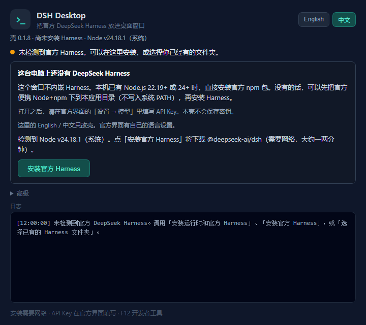

# DSH Desktop

[English](README.md) | 中文

[](https://github.com/shenzheyuan2020/dsh-desktop-shell/releases/latest)
[](https://github.com/shenzheyuan2020/dsh-desktop-shell/actions/workflows/ci.yml)
[](LICENSE)

把官方 DeepSeek Harness（`dsh web`）放进 Windows 桌面窗口：系统托盘、关窗进托盘、崩溃自动重启、首次可一键安装运行时与官方 CLI，「更新壳」与「更新官方 Harness」彼此独立。

**壳是我们的，窗口里的界面是官方原版。** 不 fork、不内嵌、不注入官方源码。官方 Harness 怎么升级，窗口里就是什么。



## 目录

- [与官方 Harness 的对接方式](#与官方-harness-的对接方式)
- [安装](#安装)
- [第一次打开](#第一次打开)
- [日常使用](#日常使用)
- [更新：壳与官方 Harness](#更新壳与官方-harness)
- [语言](#语言)
- [配置](#配置)
- [故障排查](#故障排查)
- [开发](#开发)
- [发版（维护者）](#发版维护者)
- [已知限制](#已知限制)
- [更新日志](#更新日志)
- [许可证](#许可证)

## 与官方 Harness 的对接方式

只有三条契约，再无其它：

1. **启动** — spawn 配置里的 `command` + `args`（没写端口就追加 `--port 0`）。
2. **就绪** — 等 stdout 出现 `dsh web: <URL>`，零注入加载该地址（无 preload、开启沙箱、只放行本机地址，其余链接交给系统浏览器）。
3. **结束** — 退出或重启时结束整棵后端进程树。

给模型加工具或界面，请走官方 bundle / profile / slot，不要改这个壳。

官方项目：[deepseek-ai/deepseek-harness](https://github.com/deepseek-ai/deepseek-harness) · npm 包：[`@deepseek-ai/dsh`](https://www.npmjs.com/package/@deepseek-ai/dsh)

## 安装

1. 打开 [最新 Release](https://github.com/shenzheyuan2020/dsh-desktop-shell/releases/latest)。
2. 下载 **`DSH-Desktop-Setup-<版本>.exe`**（约 95 MB）。不要下 Source code 压缩包——那是源码不是应用。
3. 安装包未签名。SmartScreen 出现时点 **「更多信息」→「仍要运行」**。每个 Release 的说明里附有安装包 **SHA-256**，谨慎的话可用 `Get-FileHash` 核对。
4. 从开始菜单或桌面快捷方式打开 **DSH Desktop**。

请用 Setup 安装。壳的自动更新只对安装版生效；`dist/win-unpacked` 是开发产物，永远不会更新。

## 第一次打开

每次启动，壳按以下顺序查找官方 DeepSeek Harness：

1. 当前 `config.json` 的启动路径（`cwd` 里的源码仓库，或你选过的 `dsh.cmd`）
2. 环境变量 `DSH_CHECKOUT` 指向的克隆（目录里有 `apps/cli/src/bin.ts`）
3. 本壳装过的官方 npm 包：`%APPDATA%\DSH Desktop\official-runtime`
4. PATH 上的 `dsh` 命令

找到任意一种就直接打开官方界面；一种都没有时，启动页停在一段短向导上——你不确认，壳不会擅自安装。

### 方式 A — 在壳里安装（不用 git clone）

Node 不必自己先装。壳按序使用：**系统** Node.js 22.19+/24+（带 npm）→ 已下到 `%APPDATA%\DSH Desktop\bundled-node` 的**本应用**官方 Node（不写系统 PATH）→ 都没有时由主按钮下载。

| 这台电脑 | 主按钮 | 会做什么 |
|---|---|---|
| 有合格系统 Node，没有 Harness | **安装官方 Harness** | 只用系统 Node，不多下载任何东西。 |
| 没有合格 Node | **安装运行时和官方 Harness** | 下载官方 Node.js（Windows x64 zip，对官方校验和验证 SHA-256）到 `bundled-node`，再把 `@deepseek-ai/dsh` 装进 `official-runtime`。 |
| 已选仓库或文件夹 | — | 直接打开官方界面。 |

网络说明：Node 压缩包先试 nodejs.org 再试 npmmirror；npm 安装默认源失败自动用 `https://registry.npmmirror.com` 重试；`config.json` 里的 `"npmRegistry"` 可覆盖。

**高级**里保留其余动作：**只安装本应用 Node**、**从 nodejs.org 安装系统 Node.js**（选 22.19+ 或 24，不要选 20）、**选择已有的 Harness 文件夹…**、**编辑 config.json**、**重新检测**、**重启后端**。

官方界面打开后，API Key 在其 **设置 → 模型** 里填写。壳不保存密钥。

### 方式 B — 你已经有 Harness

**选择已有的 Harness 文件夹…**（高级或托盘）打开文件夹选择框，接受：

- 带 `apps/cli/src/bin.ts` 的 git 克隆
- 内含 `dsh.cmd` / `dsh` 的文件夹
- 内含 `node_modules\.bin\dsh.cmd` 的文件夹

选中即写入 `config.json` 并启动，不需要手改 JSON。在壳外自行安装后，点**重新检测**；窗口重新获得焦点时也会自动再查。

## 日常使用

托盘图标是青色 `>_`。右键：

| 项 | 含义 |
|---|---|
| **显示窗口** | 唤回官方界面（双击托盘相同）。 |
| **后端控制台** | 重新打开启动页：日志、版本、高级动作。 |
| **在浏览器中打开** / **复制访问地址** | 系统浏览器看同一套官方 UI / 复制 `http://127.0.0.1:<端口>`。 |
| **安装运行时和官方 Harness** | 没有可用 Node 时出现：本应用 Node + 官方 Harness。 |
| **安装 / 更新官方 Harness** | 在应用目录 npm 安装或更新 `@deepseek-ai/dsh`，先确认。 |
| **只安装本应用 Node** | 只下官方 Node 到 `bundled-node`；装过即隐藏。 |
| **选择已有的 Harness 文件夹…** | 带校验的文件夹选择。 |
| **重启后端** | 只重启 `dsh web`，窗口跟到新端口。 |
| **查看后端日志** / **编辑 config.json** | `%APPDATA%\DSH Desktop\logs` / 配置文件。 |
| **语言 / Language** | English 或中文——只作用于壳。 |
| **检查壳更新** / **打开壳的发布页** | GitHub Releases，只更新壳。 |
| **退出（结束后端）** | 退出壳并结束 `dsh web`。 |

关窗只是进托盘，后端继续跑（第一次会弹一次说明）。F12 打开开发者工具。窗口标题、托盘提示、启动页顶部始终显示壳版本、Harness 版本与种类、Node 是**系统**还是**本应用**。

## 更新：壳与官方 Harness

两个互不相干的动作：

- **壳** — Setup 安装版启动约 8 秒后检查 GitHub Releases，此后每 6 小时一次；也可用托盘**检查壳更新**。更新只替换壳本身。开发模式与 `win-unpacked` 永不自动更新。
- **官方 Harness** — 托盘**更新官方 Harness** 对 `official-runtime` 里的 `@deepseek-ai/dsh` 跑 npm。不动 Setup 安装、你的源码仓库和 API Key。

## 语言

首次运行跟随 Windows 显示语言（`zh*` → 中文，否则英文）。随时可在启动页右上角或托盘 **Language** 切换；选择持久化为 `config.json` 的 `"locale"`，立即生效。官方 Harness 界面有自己的语言设置，壳不去动它。

## 配置

文件：`%APPDATA%\DSH Desktop\config.json`（托盘**编辑 config.json**）。改 `command` / `args` / `cwd` 后点**重启后端**。

什么都没找到时的默认值（首次写入语言跟系统）：

```json
{
  "command": "dsh",
  "args": ["web"],
  "cwd": "",
  "env": {},
  "shell": true,
  "locale": "zh"
}
```

源码仓库启动（或直接用**选择文件夹**）：

```json
{
  "command": "node",
  "args": ["--import", "tsx/esm", "apps/cli/src/bin.ts", "web"],
  "cwd": "D:\\path\\to\\deepseek-harness",
  "env": {},
  "shell": false,
  "locale": "zh"
}
```

| 字段 | 含义 |
|---|---|
| `command` / `args` | 拉起的进程。没写 `--port` 时壳追加 `--port 0`（系统分配）。 |
| `cwd` | 工作目录；源码启动必须是仓库根。 |
| `env` | 附加环境变量，叠在进程环境上。使用本应用 Node 时其目录会前置到这里的 `PATH`。 |
| `shell` | Windows 上 `command` 为 `dsh` 或 `.cmd` 垫片时须为 `true`。 |
| `locale` | `"en"` 或 `"zh"`；语言切换器写入，立即生效。 |
| `npmRegistry` | 可选。npm 安装先试它，再默认源，再 npmmirror。 |
| `closeToTrayHintShown` | 首次关窗说明弹过后写入。 |
| `harnessVersion` | 官方包装好后写入；界面也会现场读 `package.json`。 |

路径：日志 `%APPDATA%\DSH Desktop\logs\backend.log`（5 MB 轮转）；官方包在 `official-runtime`；本应用 Node 在 `bundled-node`。设好 `DSH_CHECKOUT` 后删除 `config.json` 再启动，可按新默认重写。

## 故障排查

| 现象 | 处理 |
|---|---|
| 「这台电脑上还没有 DeepSeek Harness」 | 确认主安装按钮，或**选择已有的 Harness 文件夹**。 |
| 「没有可用的 Node.js 22.19+ 或 24」 | **安装运行时和官方 Harness**，或高级 → 本应用 Node / 官网系统 Node（不要 20）。 |
| npm 退出码非 0 | 网络/源问题；npmmirror 已自动重试过。可设 `npmRegistry`，或自行安装后选文件夹。 |
| 一直不出现 `dsh web: http://127.0.0.1:…` | 后端起了但没就绪。**后端控制台**看日志；或指向源码仓库。 |
| `'dsh' 不是内部或外部命令` / `ENOENT` | PATH 上没有。用安装按钮或选文件夹。 |
| SmartScreen 拦截安装包 | 未签名构建：**更多信息 → 仍要运行**；不放心先按发版说明核对 SHA-256。 |

## 开发

```sh
git clone https://github.com/shenzheyuan2020/dsh-desktop-shell.git
cd dsh-desktop-shell
pnpm install
pnpm start          # 开发运行；此模式下壳不检查更新，属预期
pnpm run dist       # 产出 NSIS 安装包与 latest.yml 到 dist/
node scripts/check-i18n.mjs                         # 中英键位与占位符一致性
node_modules/electron/dist/electron.exe scripts/shot.mjs   # 重新生成 README 截图
```

开发机固定指向源码仓库：`setx DSH_CHECKOUT "D:\path\to\deepseek-harness"`，然后重启壳。

CI（`.github/workflows/ci.yml`）在每次 push 与 PR 运行：全部 JS 语法检查、中英文案一致性、以及 `CHANGELOG.md` 必须含当前 `package.json` 版本的小节。

pnpm 11 默认拦截依赖构建脚本；`pnpm-workspace.yaml` 已放行 `electron` 与 `electron-winstaller`。若缺 `node_modules/electron/dist/electron.exe`：

```powershell
$env:ELECTRON_MIRROR='https://npmmirror.com/mirrors/electron/'; node node_modules/electron/install.js
```

## 发版（维护者）

1. 在 `CHANGELOG.md` 加 `## [x.y.z] - 日期` 小节（CI 强制）。
2. 改 `package.json` 的 `version`，提交。
3. 打标签并推送：

```sh
git tag vX.Y.Z
git push origin main vX.Y.Z
```

发版工作流构建安装包，用 `scripts/release-notes.mjs` 从更新日志小节 + 安装包 SHA-256 生成 Release 说明（缺任何一样都会失败），经 `action-gh-release` 发布。不要对同一标签再手动 `gh release create`。

## 已知限制

- 安装包未签名（首次运行可能遇 SmartScreen）；仅 Windows x64。
- 壳自动更新只对 Setup 安装版生效。
- 官方 Harness 需要真正的官方 `node.exe`+`npm`（Electron 自带的跑不了）；Setup 不内置该 zip——壳按需下载，或用本机合格系统 Node。
- 官方界面的语言不由本壳控制。
- 尚未实现：开机自启、全局快捷键、多 profile 切换。

## 更新日志

见 [CHANGELOG.md](CHANGELOG.md)。GitHub 各 Release 的说明按标签由它生成。

## 许可证

[MIT](LICENSE) © shenzheyuan2020
